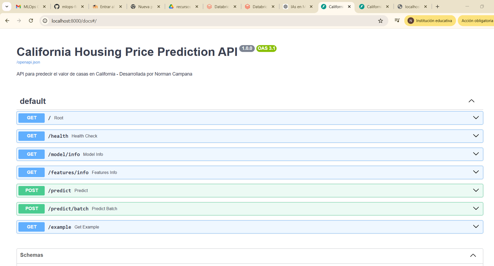

# 📊 Reporte de Predicciones - California Housing

## 👤 Autor: Norman Campana
## 📅 Fecha: Febrero 2026

---

## 🎯 Resumen Ejecutivo

Este documento muestra los resultados de las predicciones generadas por la API del modelo de Random Forest entrenado con el dataset de California Housing. El modelo alcanzó un **R² de 0.8024** y un **RMSE de $44,430 USD**.

---

## 🌐 Endpoint: `/predict` - Predicción Individual

### 📸 Captura de Swagger UI

*[Nota: Agrega aquí una captura de pantalla de http://localhost:8000/docs]*



---

### 🏚️ **Caso 1: Casa de Bajo Valor (Zona Rural)**

**Características:**
| Variable | Valor | Descripción |
|----------|-------|-------------|
| MedInc | 2.0 | Ingreso bajo ($20,000) |
| HouseAge | 50.0 | Casa antigua |
| AveRooms | 4.0 | Pocas habitaciones |
| AveBedrms | 1.0 | 1 dormitorio |
| Population | 3000 | Zona poblada |
| AveOccup | 4.5 | Alta ocupación |
| Latitude | 35.0 | Valle Central |
| Longitude | -119.0 | Interior |

**Request (curl):**
```bash
curl -X POST "http://localhost:8000/predict" \
  -H "Content-Type: application/json" \
  -d '{
    "MedInc": 2.0,
    "HouseAge": 50.0,
    "AveRooms": 4.0,
    "AveBedrms": 1.0,
    "Population": 3000.0,
    "AveOccup": 4.5,
    "Latitude": 35.0,
    "Longitude": -119.0
  }'